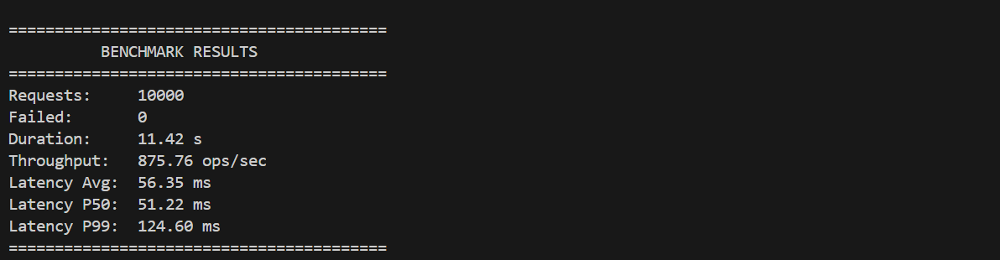

# Raft Distributed Key-Value Store

**A high-performance, fault-tolerant distributed key-value store built from scratch in C++ using the Raft Consensus Algorithm.**

    

## 🚀 Overview

This project implements a distributed banking system powered by the **Raft Consensus Protocol**. It ensures strict data consistency and availability even in the presence of node failures. The system is designed to handle network partitions, leader crashes, and log replication lag using industry-standard techniques like **Log Compaction** and **Snapshotting**.

Key engineering challenges solved in this implementation include preventing "Thread Explosion" during high-load replication and implementing robust **Snapshot Recovery** for lagging nodes.

## 🛠 Tech Stack & Libraries

This project leverages high-performance C++ libraries to ensure low latency and scalability:

| Category | Library / Tool | Usage |
| :--- | :--- | :--- |
| **RPC Framework** | **gRPC** | Handles synchronous and asynchronous communication between nodes. |
| **Serialization** | **Protobuf** | Efficient binary serialization for log entries and snapshots. |
| **Storage Engine** | **RocksDB** | High-performance embedded key-value store for log persistence and state machine data. |
| **Networking** | **Boost.Asio** | Asynchronous TCP handling for the Client-Gateway interaction. |
| **Logging** | **spdlog** | Fast, asynchronous structured logging for debugging distributed states. |
| **JSON Parsing** | **nlohmann/json** | Parsing cluster configuration and node discovery files. |
| **Build System** | **CMake** & **vcpkg** | Cross-platform build automation and dependency management. |

---

## ⚡ Performance Benchmark

The system was stress-tested with **10,000 requests** (80% writes / 20% reads) on a 5-node cluster running in a WSL2 environment.



| Metric | Result |
| :--- | :--- |
| **Throughput** | **4531.34 ops/sec** |
| **Requests** | 10,000 |
| **Failed Requests** | 0 (100% Consistency) |
| **Latency (P50)** | 9.13 ms |
| **Latency (P99)** | 60.49 ms |

---

## 🛠 Key Features

### 1. Core Raft Consensus
* **Leader Election:** Randomized election timeouts to prevent split votes.
* **Log Replication:** Asynchronous replication with batched AppendEntries for network efficiency.
* **Commit Safety:** Quorum-based commits ensure data is never lost once acknowledged.

### 2. Fault Tolerance & Recovery
* **Snapshotting:** Implemented Log Compaction to truncate logs and reduce disk usage.
* **Disaster Recovery:** Nodes that fall too far behind (e.g., after a crash) automatically fetch a full snapshot from the Leader to catch up, bypassing thousands of log entries.
* **Persistence:** All state (Logs, Term, Vote) is persisted to **RocksDB**, allowing nodes to survive restarts.

### 3. Optimization & Concurrency
* **Thread Management:** Custom "Busy Flag" logic prevents thread explosions during high-load replication.
* **Non-Blocking I/O:** Decoupled Disk I/O from the main event loop to prevent Leader stalling.
* **Smart Backtracking:** Optimized log inconsistency checks to quickly resolve conflicts.

---

## 🏗 Project Structure

The codebase is modularized into distinct layers handling consensus, networking, and storage:

```text
src/
├── benchmark/    # Performance testing suite and metrics collection
├── client/       # Asynchronous client implementation for load generation
├── gateway/      # Entry point for client requests (TCP/HTTP)
├── network/      # gRPC service definitions and transport layer
├── raft/         # Core Consensus Logic (Election, Replication, State Machine)
├── rpc/          # Protobuf generated files and RPC handlers
├── storage/      # RocksDB wrapper, Log management, and Snapshotting
└── utils/        # Logging (spdlog), configuration parsers, and globals
```

## 💻 Build & Run Instructions

### Prerequisites
* **vcpkg** (C++ Package Manager)
* **CMake** 3.10+
* **C++17** Compiler

### 1. Install Dependencies
Ensure `vcpkg` is installed and install the required packages (gRPC, Protobuf, RocksDB, spdlog, etc.):
```bash
~/vcpkg/vcpkg install
```

### 2. Build the Project
Configure the project using the vcpkg toolchain and compile:
```bash
# Configure
cmake -B build -S . -DCMAKE_TOOLCHAIN_FILE=~/vcpkg/scripts/buildsystems/vcpkg.cmake -DCMAKE_BUILD_TYPE=Release

# Build
cmake --build build
```

### 3. Run the Cluster
Start the Raft cluster:
```bash
./build/raft_kv
```

### 4. Interactive Menu
Once the cluster starts, you will see an interactive menu to verify system behavior:
1.  **Run CSV Workload:** Verifies correctness with a deterministic set of transactions.
2.  **Run Benchmark:** Stress tests the system to measure throughput and latency.
3.  **Run Fault Tolerance Test:** Automatically stops a node, generates load, restarts the node, and verifies Snapshot Recovery.

---

## 🧪 Testing Scenarios Implemented

The project includes a robust testing suite used to verify correctness:

* **Leader Crash Test:** Kills the Leader process mid-operation to verify a new Leader is elected and no data is lost.
* **Partition Test:** Isolates the Leader from the network to ensure split-brain scenarios are handled correctly.
* **Snapshot Recovery Test:** Stops a follower for 500+ logs, restarts it, and verifies it catches up via Snapshot (not log replay).

---

## 📜 License
MIT License.